En este Writeup resolvemos la máquina **Silentium** de Hack The Box. Exploramos una instancia de Flowise, explotamos un Account Takeover (CVE-2025-58434) y escalamos privilegios mediante Gogs RCE.

This Writeup solve the **Silentium** machine. This machine focus no Flowise with an account takeover, and scale privilegios with Gogs RCE

## 1. Scanning

**IP:** 10.129.36.104

### 1.1. Nmap

```bash
# Open ports
sudo nmap -sS -p- --min-rate 5000 -n -Pn --open 10.129.36.104 -oN targeted

# Basic scripts to the open ports
sudo nmap -sCV -p 22,80 10.129.36.104 -oG openPorts
```

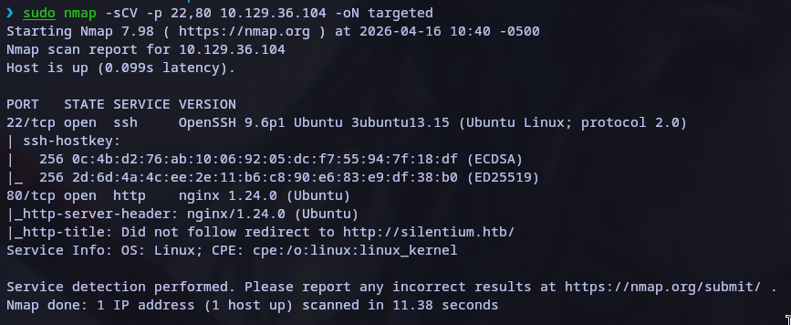

## 2. Enumeration

### 2.1. Web discovery

Discover the port 80 run on http, first add the domain `silentium.htb` to `/etc/hosts` file

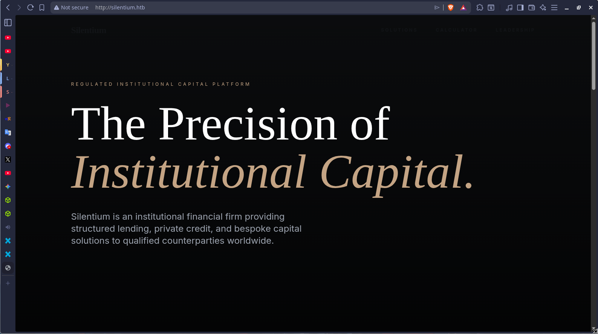

### 2.2. Directory fuzzing

First fuzzing the directories. Also we didn't find anything, then we

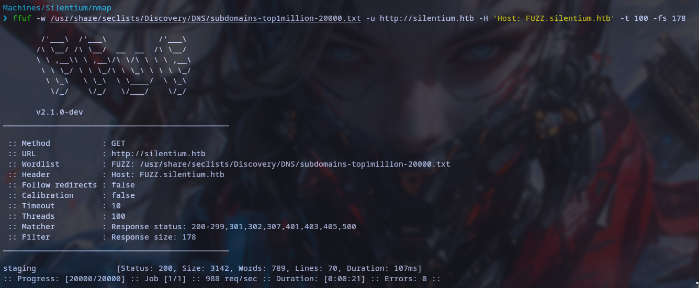
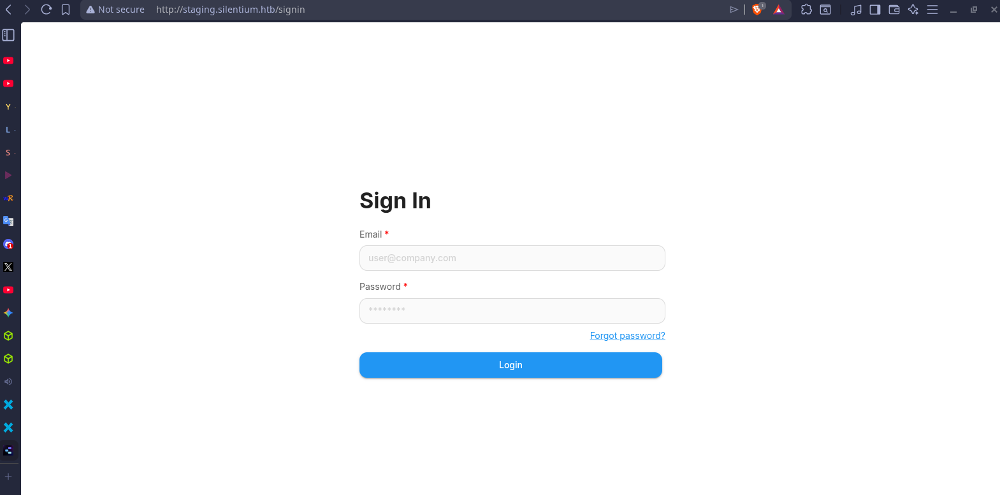

Discover the `flowise`

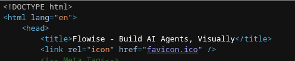

### 2.3. User discovery

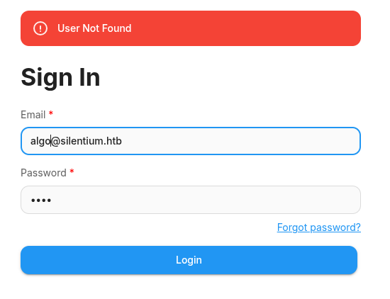

Find users

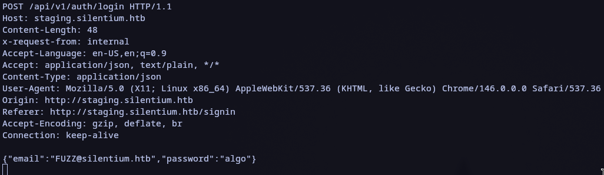
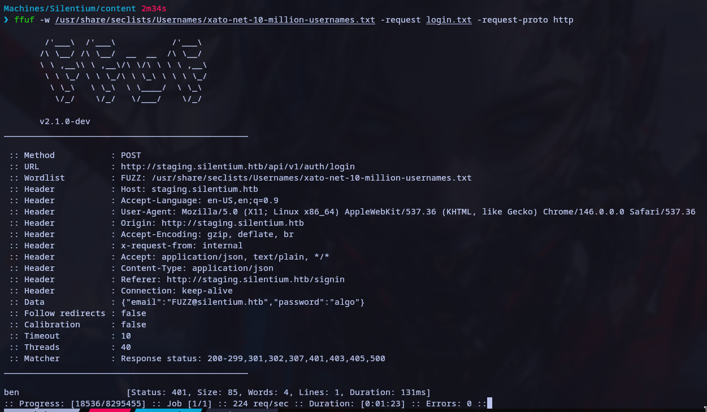

The user <ben@silentium.htb> exist, we can use the exploit

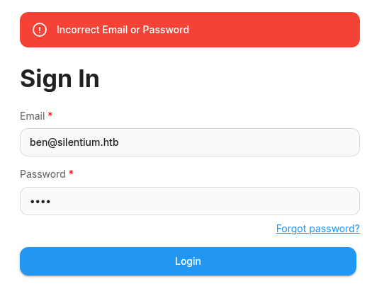

## 3. Exploitation

<https://github.com/vanhari/CVE-2025-59528> -> RCE

[https://github.com/AzureADTrent/CVE-2025-58434-59528](https://github.com/advisories/GHSA-wgpv-6j63-x5ph) -> Unauthenticated Account Takeover

### 3.1. Account takeover

Intercept the forgot password process.

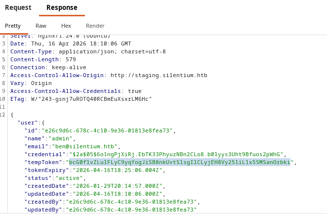

Use the reset password process to create a new password

Password123. -> New Password

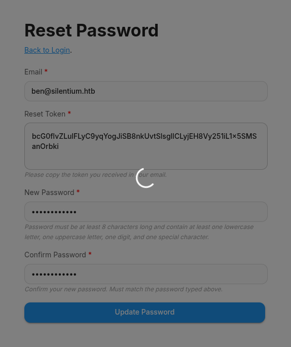

### 3.2. RCE exploit

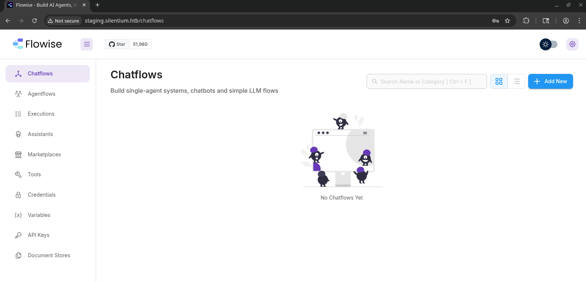
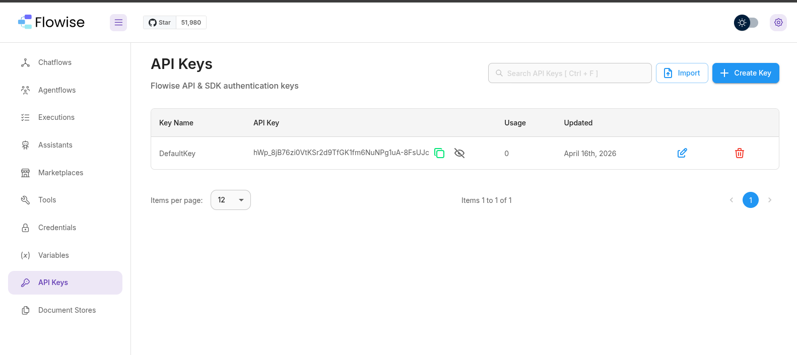
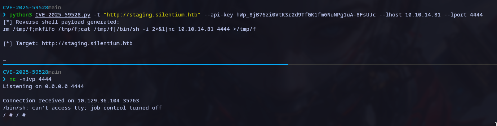

Docker enviroment Variables

Login with ssh

User = ben
Password = r04D!!_R4ge
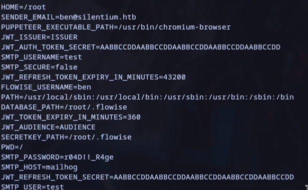

Flag user.txt

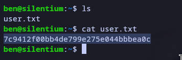

## 4. Privilege Escalation

### 4.1. Internal ennumeration

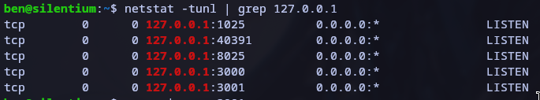

curl -i <http://127.0.0.1:3001> -> To show the service

### 4.2. Port Forwarding

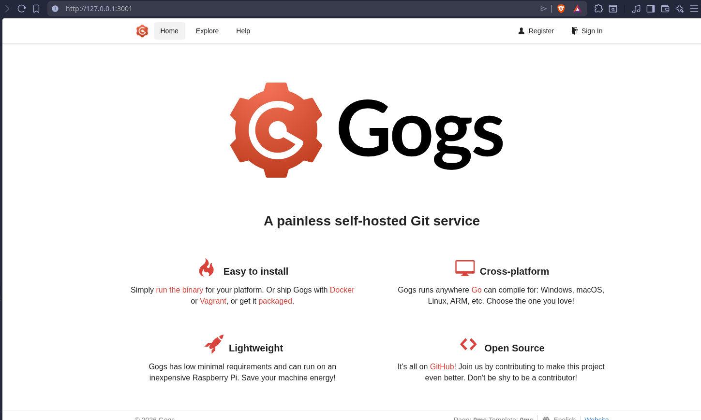

user: jon | mail -> <jon@jon.com>  | password: jon

### 4.3. RCE exploit

<https://github.com/TYehan/CVE-2025-8110-Gogs-RCE-Exploit> -> RCE

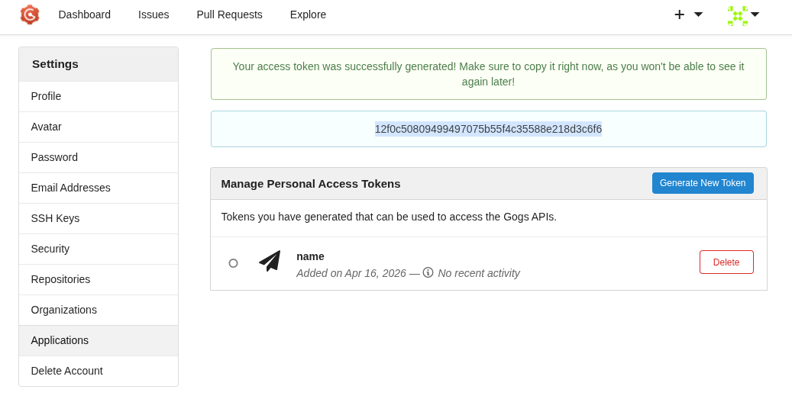

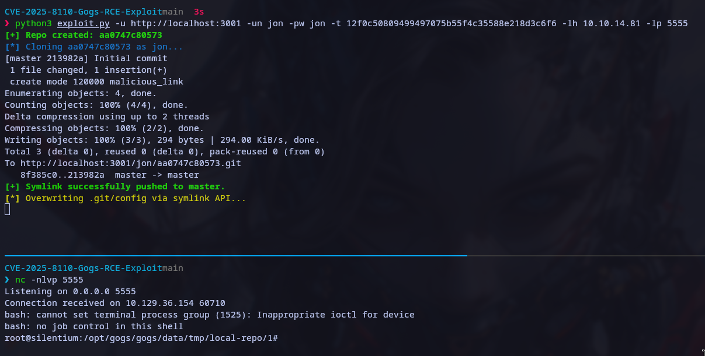

## 5. Sumary of Credentials & notes

### 5.1. Sumary of Credentials

- Password Created to loging in `http://staging.silentium.htb/signin`

<ben@silentium.htb> -> Password123.
